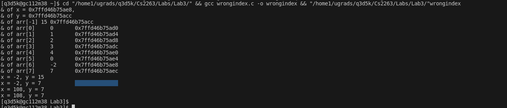

# Lab 3

## Contents

- [Pre Lab](#answer)
- [Exercise1](#exercise-1)
    -[Source Code](#source-code)
    -[Output](#output-screenshot)
    -[Extra Questions](#are-the-increments-for-different-pointers-the-same-explain-why)
- [Exercise2](#exercise-2)
    -[Source Code](#source-code-1)
    -[Output](#output-screenshot-1)
- [Exercise3](#exercise-3)
    -[Source Code](#source-code-2)
    -[Output](#output-screenshot-2)
- [Exercise4](#exercise-4)
    -[Compiler](#compiler-command)
    -[Source Code](#source-code-3)
    -[Output](#output-screenshot-3)
    -[Diagram](#diagram-of-memory-locations)
    -[Extra Questions](#are-the-results-ie-numerical-values-printed-from-your-program-different-from-the-results-shown-in-the-textbook-explain-why)


## Pre Lab
Briefly (in couple of sentences) explain what is the meaning of the following reference to array a[]:

   ``` a[-1] ```

### Answer
In C, negative indexing of arrays doesnt exist like python or java. C will attempt to access a memory location before the start of the array `a[]` which will lead to a undefined behavior. This causes c to crash and cause a segmentation fault or unexcepted error. All due to accessing memory that the array has not been allocated for.


## Exercise 1

### Source code
```
// arithmetic1.c
#include <stdio.h>
#include <stdlib.h>
int main (int argc ,char * * argv)
{
    int    arr1[] = {7, 2, 5, 3, 1, 6, -8, 16, 4};
    char   arr2[] = {'m', 'q', 'k', 'z', '%', '>'};
    double arr3[] = {3.14, -2.718, 6.626, 0.529};

    int len1 = sizeof(arr1) / sizeof(int);
    int len2 = sizeof(arr2) / sizeof(char);
    int len3 = sizeof(arr3) / sizeof(double);

    printf("lengths = %d, %d, %d\n", len1, len2, len3);


    int    * iptr = arr1;
    char   * cptr = arr2;
    double * dptr = arr3;


    printf("addresses = %p, %p, %p\n", (void*) iptr, (void*) cptr, (void*) dptr);
    printf("values = %d, %c, %f\n", * iptr, * cptr, * dptr);


    iptr ++;
    cptr ++;
    dptr ++;


    printf("addresses = %p, %p, %p\n", (void*) iptr, (void*) cptr, (void*) dptr);
    printf("values = %d, %c, %f\n", * iptr, * cptr, * dptr);


    iptr ++;
    cptr ++;
    dptr ++;

    printf("addresses = %p, %p, %p\n", (void*) iptr, (void*) cptr, (void*) dptr);
    printf("values = %d, %c, %f\n", * iptr, * cptr, * dptr);


    iptr ++;
    cptr ++;
    dptr ++;


    printf("addresses = %p, %p, %p\n", (void*) iptr, (void*) cptr, (void*) dptr);
    printf("values = %d, %c, %f\n", * iptr, * cptr, * dptr);


    return EXIT_SUCCESS;
}
```

### Output Screenshot


### Are the pointer variables incremented between successive print operations?

Yes all the pointer varibles are being incremented between the successive print operations

### Use the memory addresses printed by your program to calculate the increments used for each pointer variable.

#### tptr (int pointer)

The increment is 4 bytes (0000003c533ff980 - 0000003c533ff984 - 0000003c533ff988 - 0000003c533ff98c)
which is the size of the int in the program being run

#### cptr (char pointer)

The increment is 1 byte (0000003c533ff97a - 0000003c533ff97b - 0000003c533ff97c - 0000003c533ff97d)
which is the size of the char in the program being run

#### dptr (double pointer)

The increment is 8 bytes (0000003c533ff950 - 0000003c533ff958 - 0000003c533ff960 - 0000003c533ff968)
which is the size of the double in the program being run

### Are the increments for different pointers the same? Explain why.

No depeding on the data type the pointers increments will be different, due to the different byte size of the data types 
```
    int = 4 bytes
    char = 1 byte
    double = 8 bytes
```
In c when you increment a pointer it moves to the next element of its data type meaning that the three pointers will never increement the same way for this program.

## Exercise 2

### source code
// arithmetic1.c
#include <stdio.h>
#include <stdlib.h>

void printArray(int arr[], int len){
    int *aptr = arr;
    printf("Index\tValue\tAddress\t\t\tValue\n");
    for(int i = 0; i < len; i++){
        printf("%d\t%d\t%p\t%d\n", i, arr[i], &arr[i], *aptr++);

    }
}


int main (int argc ,char * * argv)
{
    //for exercise 2
    int arr[] = {10, 11, 12, 13, 14, 15, 16};
    int len = sizeof(arr) / sizeof(int);
    printArray(arr, len);

    return EXIT_SUCCESS;
}
```
### Output Screenshot


## Exercise 3

### source code 
```
#include <stdio.h>
#include <stdlib.h>


int arrindex(int a[], int * p){
    return p - a;
}


int main (int argc ,char * * argv)
{

    //for exercise 3
    int arr[] = {10, 11, 12, 13, 14, 15, 16};
    for (int i = 0; i < sizeof(arr)/sizeof(arr[0]); i ++){
        printf ("%d\t%p\n", i, arrindex( arr, & arr[i]));
    }
    return EXIT_SUCCESS;
}
```
### Output Screenshot


## Exercise 4

## Compiler command
`if ($?) { gcc wrongindex.c -o wrongindex } ; if ($?) { .\wrongindex }`

### source code 
```
/*
 * wrongindex.c
 */
#include <stdio.h>
#include <stdlib.h>
#include <string.h>
int main(int argc, char * * argv)
{
    int x = -2;
    int arr[] = {0, 1, 2, 3, 4};
    int y = 15;

    //memory address of x and y
    //printf("& x = %p, & y = %p\n", (void*)& x, (void*)& y);

    printf("& of x = %p,\n& of y = %p\n", & x, & y);


    //one invaild
    printf("& of arr[%d] = %p\n", -1, (void *)&arr[-1]);

    //all valid
    for(int i = 0; i < sizeof(arr)/sizeof(arr[0]); i++){
        printf("& of arr[%d] = %p\n", i, (void *)&arr[i]);
    }
   

    printf("x = %d, y = %d\n", x, y);

    arr[-1] = 7;
    arr[5]  = -23;

    printf("x = %d, y = %d\n", x, y);


    arr[6]  = 108;

    printf("x = %d, y = %d\n", x, y);

    arr[7]  = -353;

    printf("x = %d, y = %d\n", x, y);

    return EXIT_SUCCESS;
}
```
### Output Screenshot


### Diagram of memory locations

### Are the results (i.e. numerical values) printed from your program different from the results shown in the textbook? Explain why

#### Memory addresses

My memory address will be completely diffrenet due to c being a hardware low level language so our memory addresses/pointers wil most likely always be different.

#### Numeric Changes
In the text they do the out of bounds call `arr[-1]` there x changes to 108 while my y changes to 7 when I call `arr[-1]` this means that it does not overlap with y in my program due to my personal memory layout. 

#### TextBook Results
```
& x = 0x7fffcabf4e68, & y = 0x7fffcabf4e6c
& arr[0] = 0x7fffcabf4e50, & arr[4] = 0x7fffcabf4e60
x = -2, y = 15
x = -2, y = 15
x = 108, y = 15
x = 108, y = -353

As we can see, x has changed because of this assignment:
    arr [6] = 108;
Similarly, y is changed because of this assignment:
    arr [7] = -353;

```
#### My Results
```
& of x = 00000083661ffb98,
& of y = 00000083661ffb7c
& of arr[-1] = 00000083661ffb7c
& of arr[0] = 00000083661ffb80
& of arr[1] = 00000083661ffb84
& of arr[2] = 00000083661ffb88
& of arr[3] = 00000083661ffb8c
& of arr[4] = 00000083661ffb90
x = -2, y = 15
x = -2, y = 7
x = 108, y = 7
x = 108, y = 7
```
