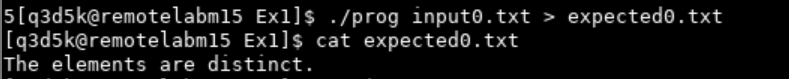
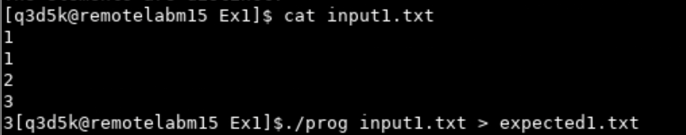
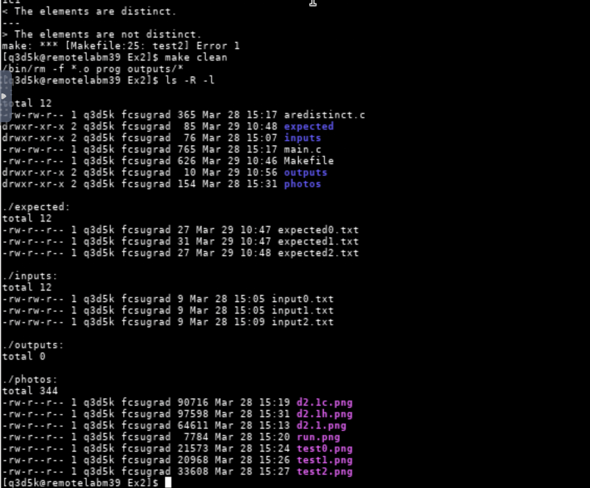
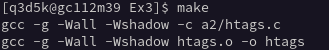

# CS2263

## Lab 5
**Date:** March 29th, 2024  
---
**Student:**  
Name: Will Ross  
Number: #3734692  
Email: [will.ross@unb.ca](mailto:will.ross@unb.ca)
 
**Due Date:** April 2nd, 2024

---
## Contents
- [CS2263](#cs2263)
  - [Lab 5](#lab-5)
  - [**Date:** March 29th, 2024](#date-march-29th-2024)
  - [Contents](#contents)
  - [Exercise 1 (preparing input and expected output files for Exercise 2)](#exercise-1-preparing-input-and-expected-output-files-for-exercise-2)
    - [Deliverable 1.1a](#deliverable-11a)
    - [Deliverable 1.1b](#deliverable-11b)
    - [Deliverable 1.1c](#deliverable-11c)
    - [Deliverable 1.1d](#deliverable-11d)
  - [Exercise 2 (running three test on areDistinct using make)](#exercise-2-running-three-test-on-aredistinct-using-make)
    - [Deliverable 2.1a](#deliverable-21a)
    - [Deliverable 2.1b](#deliverable-21b)
    - [Deliverable 2.1c](#deliverable-21c)
    - [Deliverable 2.1d](#deliverable-21d)
    - [Deliverable 2.1e](#deliverable-21e)
    - [Deliverable 2.1f](#deliverable-21f)
    - [Deliverable 2.1g](#deliverable-21g)
    - [Deliverable 2.1h](#deliverable-21h)
  - [Exercise 3 (running, with make, two versions of htags and automatically comparing the results)](#exercise-3-running-with-make-two-versions-of-htags-and-automatically-comparing-the-results)
    - [Deliverable 3.1a](#deliverable-31a)
    - [Deliverable 3.1b](#deliverable-31b)
    - [Deliverable 3.1c](#deliverable-31c)
    - [Deliverable 3.1d](#deliverable-31d)


<div style="page-break-after: always;"></div>


## Exercise 1 (preparing input and expected output files for Exercise 2)
--- 

### Deliverable 1.1a
The printout (or screen shot) showing the first data set with no repeated numbers, i.e. the contents of the file input0.


### Deliverable 1.1b
The printout of the output form areDistinct program on the first data set, i.e. the contents of the file expected0.




### Deliverable 1.1c
The printout showing the second data set with some numbers repeated, i.e. the contents of the file input1,




### Deliverable 1.1d
The printout of the output form areDistinct program on the second data set, i.e. the contents of the file expected1.


<div style="page-break-after: always;"></div>

## Exercise 2 (running three test on areDistinct using make)
---

### Deliverable 2.1a
show the contents of the Makefile,


### Deliverable 2.1b
describe how you prepare the third test that is designed to fail,

To make test2 fail inside of expected2 I had the output set to `The elements are distinct.` when the input was 

```
3
3
3
2
1
```

So the output of `aredistinct` should be `The elements are not distinct`. Doing this provided us with a failed test.

### Deliverable 2.1c
show the directory structure and all the files of your project, for example: 
`$ ls –R -l`
(Note: the -R option prints the contents of all  subdirectories.),


run make to compile your program,


### Deliverable 2.1d
show all the directories and all the files again,


### Deliverable 2.1e
show the time stamps for one of the source code  .c files, the created corresponding object code .o file and for the executable file. Which one has an earlier times stamp (if there is a difference)?


The earlier timestamps, we seen that our modify key word when running main.c, main.o and prog. We see the diference in time. The Makefile has a recursive nature, which checks the top line which will executable to the object file. Then the .c file which is why we see the .o files are modified later then the .c file.


### Deliverable 2.1f
show the output (if any) from make, i.e. from running all the tests,


### Deliverable 2.1g
show all the directories and all the files again,



### Deliverable 2.1h
briefly describe what output and what files were generated when we used the make utility to run all three tests at once.

When using the make utility to run all three tests. They create the output.txt files, they contain information about the numbers being distinct or not. This happens due to the input redirection where the inputs are fed into the program and the results are stored in the outputs .txt files.

<div style="page-break-after: always;"></div>

## Exercise 3 (running, with make, two versions of htags and automatically comparing the results)
---

### Deliverable 3.1a 
show the directory structure and all the files of your project,


### Deliverable 3.1b
show the contents of the Makefile,


run the tests (the make should compile the files automatically),



### Deliverable 3.1c
show the output from make, if any,


### Deliverable 3.1d
comment on the result from this test of two version of the htags program.

Testing the htags and htags2 program, with htags from as2 we had to use file redirection to feed the input into the program giving us a output, while with htags2 from as3 we fed the file name in through the terminal line or in our cause in the test line in our Makefile test. Once the file was complete it was important to make sure that both had the recuired output to make sure both tests passed with the expected output. 